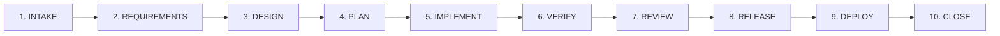

# Kiến Trúc Hệ Thống & Cơ Chế Lưu Trạng Thái (SDLC Architecture & State)

Tài liệu này giải thích cách thức Agent SDLC Harness vận hành, cách lưu trữ trạng thái, các giai đoạn (stages) và 5 cổng kiểm soát của con người (Human Confirmation Gates).

---

## 1. Chu Trình 10 Giai Đoạn (SDLC 10 Stages)

Hệ thống điều phối quy trình phát triển phần mềm qua chuỗi các giai đoạn khép kín và có bằng chứng xác thực (evidence-based):

1. **INTAKE**: Tiếp nhận yêu cầu ban đầu (từ con người, issue, bug report, hoặc proto-spec). Phân loại workflow phù hợp bằng bộ định tuyến xác định (deterministic router).
2. **REQUIREMENTS**: Chuẩn hóa yêu cầu thành tiêu chí nghiệm thu (Acceptance Criteria), ràng buộc kỹ thuật và phạm vi tác động.
3. **DESIGN**: Xác định kiến trúc, đánh giá tradeoff, phát hiện rủi ro chính sách (policy violations). Với profile `STRICT`, con người phải phê duyệt thiết kế (Gate 1).
4. **PLAN**: Chia nhỏ yêu cầu thành đồ thị các task độc lập (`task-plan/v1`), ràng buộc phạm vi ghi mã (`write-scope`), và nghĩa vụ kiểm thử cho từng task.
5. **IMPLEMENT**: Phân bổ worker subagents thực thi từng task trong không gian làm việc cô lập (workspace isolation).
6. **VERIFY**: Kiểm thử tự động trên kết quả tích hợp: unit test, targeted verification, tích hợp CI và quét bảo mật bí mật (secret scan).
7. **REVIEW**: Đánh giá 3 vòng độc lập: Tính đúng đắn & Logic (Bugs), An ninh mạng & Vận hành (Security), và Tuân thủ thiết kế (Compliance). Giới hạn tối đa 5 nits để tránh loãng thông tin.
8. **RELEASE**: Chuẩn bị phiên bản, kiểm tra 100% CI pass, cập nhật CHANGELOG và tạo Pull Request.
9. **DEPLOY**: Triển khai sang môi trường đích (staging/production).
10. **CLOSE**: Hoàn tất chu trình, lưu trữ bằng chứng và cập nhật tài liệu bàn giao.

---

## 2. 5 Cổng Phê Duyệt Của Con Người (5 Human Confirmation Gates)

Harness hoạt động theo nguyên tắc **tự động tối đa nhưng quyền lực tối thượng luôn thuộc về con người**. 5 cổng sau bắt buộc phải có sự xác nhận của người dùng:

| Cổng (Gate) | Tên Cổng | Giai Đoạn | Khi Nào Kích Hoạt? |
| :--- | :--- | :--- | :--- |
| **Gate 1** | Phê Duyệt Thiết Kế Cao Cấp | `DESIGN` | Khi workflow thuộc profile `STRICT` (như sửa lỗi hệ thống core, thay đổi database schema, phá vỡ API). |
| **Gate 2** | Khắc Phục Lỗi Leo Thang | `PLAN`/`IMPLEMENT` | Khi subagent thử sửa lỗi vượt quá số lần cho phép (attempt limit) hoặc phát sinh lỗi nghiêm trọng. |
| **Gate 3** | Ngoại Lệ Bảo Mật (Security) | `VERIFY` | Khi bộ quét phát hiện rủi ro lộ bí mật (secret token) hoặc lỗ hổng bảo mật nghiêm trọng. |
| **Gate 4** | Phê Duyệt Tạo Commit & Push | `RELEASE` | Khi tất cả các test và CI đã PASS 100%, trước khi tạo commit và đẩy lên nhánh từ xa (remote). |
| **Gate 5** | Triển Khai Môi Trường Sản Xuất | `DEPLOY` | Trước khi thực hiện lệnh deploy trực tiếp vào hạ tầng production. |

---

## 3. Ba Cấp Độ Rủi Ro (Risk Profiles)

1. **STRICT (Nghiêm ngặt cao)**:
   - Áp dụng cho: `hotfix`, `database-migration`, `api-breaking-change`, `security-remediation`, `infrastructure-change`, `incident-response`, `compliance-change`.
   - Bắt buộc kiểm định thiết kế đầy đủ (Gate 1), bắt buộc review độc lập (`independent_review = true`).
2. **STANDARD (Chuẩn thông thường)**:
   - Áp dụng cho: `new-feature`, `continue-feature`, `bug-fix`, `refactor`, `performance`, `dependency-upgrade`, `ci-cd-change`.
   - Chạy đầy đủ các bước kiểm tra chất lượng và CI.
3. **FAST (Nhanh, giảm thiểu thủ tục)**:
   - Áp dụng cho: `maintenance`, `documentation`, `technical-spike`, `test-only`.
   - Bỏ qua các bước thiết kế nặng nề, tập trung hoàn thành nhanh mục tiêu mà vẫn đảm bảo tính toàn vẹn.

---

## 4. Cơ Chế Lưu Bằng Chứng Xác Thực & Bộ Nhớ Bền Vững (Durable State)

- **Nguyên tắc "Evidence before claims"**: Một stage chỉ được phép chuyển sang stage tiếp theo khi file bằng chứng (evidence) tương ứng đã được ghi nhận vào `.agent-sdlc/evidence/` hoặc `runs/run_<id>.json`.
- **Chống mất mát dữ liệu**: Bản ghi trạng thái `run` sử dụng bộ đếm `revision` lũy tiến và ghi file nguyên tử (`writeJson`), ngăn chặn hoàn toàn tình trạng race condition khi nhiều tiến trình cùng truy cập.
